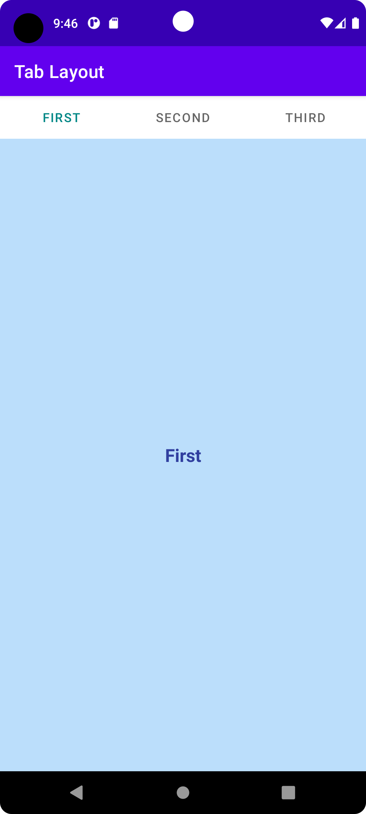
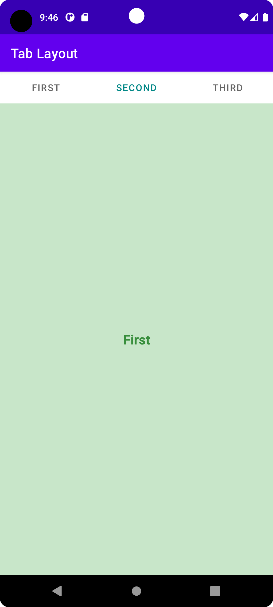
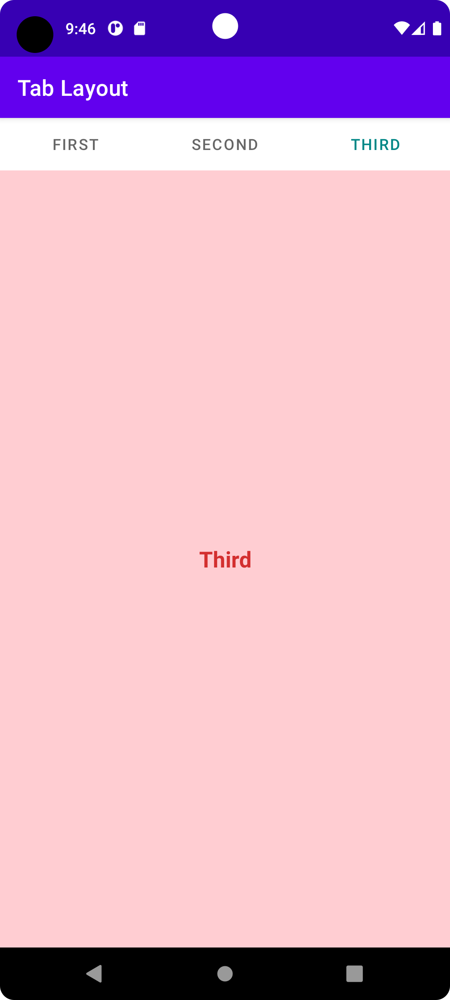

# Tab Layout with Fragments

Tabs are used in some Android apps, allowing developers to group many actions (operations) into fragments. On the other hand, it gives the app a distinct appearance. Using ViewPager, you may also provide alternative swipe experiences, such as left and right swipes. ViewPager, Fragments, and TabLayout are just a few of the concepts needed to implement this topic. The Kotlin programming language is utilized in this essay for practice.

 
 &nbsp;&nbsp;  &nbsp;&nbsp; 